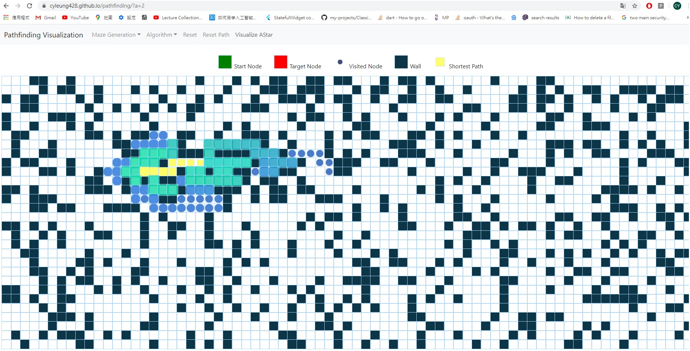

## Portfolio

---

### Software 

[Pathfinding Visualization](https://cyleung428.github.io/pathfinding/)
 

### Fun Projects

- [Classification on Spam mail using different predict models](https://github.com/cyleung428/Classification-on-spam-mail/blob/master/Project2.ipynb)
- [Problem solvings with C++ (data structure and algorithm)](https://github.com/cyleung428/Cpp-problem-solving/tree/master)
- [Employee management system with Java](https://github.com/cyleung428/CS2312/tree/master)
- [Socket Programming](https://github.com/cyleung428/socket_programming/tree/master)
- [Problem solvings with C++ (threads, mutex and semaphore)](https://github.com/cyleung428/cpp_mutux_semaphore)
